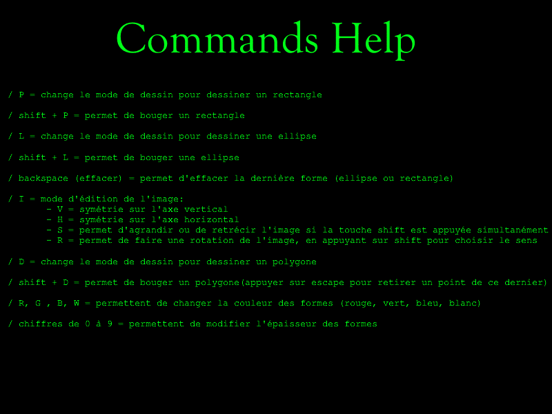

# OC 2020 : Création d'un éditeur graphique

## Introduction
Le but de ce travail est de créer un éditeur graphique en python, en utilisant la bibliothèque pygame, à l'aide des notions apprisent en cours.
_Logo.png)

## L'Éditeur graphique
Il est capable de travailler avec 4 types d'objets :
- les rectangles (touche P)
- les ellipses (touche L)
- les images (touche I)
- les polygones (touche D)
- un mode déplacement permet, en appuyant sur la touche SHIFT + touche du type, de les déplacer
- la touche A permet d'afficher l'aide aux commandes

### Les rectangles et ellipses
Ils sont dessinés à l'aide de la souris.
Les recangles, ainsi que les ellipses, ont des paramètres éditables :
- leur couleur, en appuyant sur les touches W (blanc), R (rouge), G (vert), B (bleu) (la couleur initiale étant le rouge),
- l'épaisseur de leur bordure, en appuyant sur les touches de 0 à 9 (le 0 rempli entièrement la forme),
- leur position, en activant le mode déplacement,
- il est possible d'effacer le dernier rectangle en appuyant sur BACKSPACE

### Les images
La touche C permet de charger une image, en rentrant dans l'invite de commande le nom de celle-ci.
Une fois à l'écran, il est possible :
- de la déplacer, en activant le mode déplacement
- de la tourner de plus ou moins 10 degrés (touche R ou SHIFT + R)
- de l'agrandir ou la diminuer (respectivement S ou SHIFT + S)
- de lui faire subir une symétrie d'axe vertical ou horizontal (touche V ou H)

### Les polygones
Il est possible de dessiner un polygone, qui ont comme caractéristiques :
- l'épaisseur de son trait, modulable comme pour les rectangles
- sa couleur, tout comme les rectangles
- d'effacer le dernier point, en appuyant sur ESCAPE

## Discussion
Dans cette partie, nous allons revenir sur quelques amélioration ou problèmes non résolus.
### Le mode déplacement
Il ne permet de déplacer que le dernier objet (rectangles, ellipses ou images). En théorie, le mode 'move' ne devrait pas prendre en compte
l'ordre dans lequel ils sont dessinés, car la fonction collidepoint doit juste vérifier si l'on click sur un rectangle.

### La rotation et l'échelle de l'image
Si l'on souhaite modifier l'échelle, elle est comme emportée par son inertie... Et si on la combine à une rotation, elle va continuer à tourner 
si on tente de modifier son échelle.

### Les rectangles et les ellipses
Le code qui permet de les dessiner est strictement le même ; ainsi, si on considèret que le mode rectangles et ellipses sont pareil, 
on peut les lier dans le if forme == 'rectangle' or 'ellipse'. Sauf que dans ce cas, le rectangle (ou l'ellipse) sera dupliqué dans la liste,
empechant le mode déplacement de le redéplacer.

Le problème est le même pour leur mode déplacement, qui est identique pour les 2. Dans ce cas, une erreur nous indique que le rectangle n'est pas défini.

### Dessiner plusieurs polygones
Pour l'instant, il n'est possible de dessiner qu'un seul polygone, qui est de plus impossible à déplacer.

## Conclusion
Notre éditeur, malgré quelques problèmes techniques, est fonctionnel. Il est bien entendu qu'il est possible de l'améliorer, en rajoutant par exemple 
une fonctionnalité écrivant du texte, ou améliorer la présentation du code, en complétant les classes avec des méthodes, ainsi que résoudre les problèmes
ennoncés.

